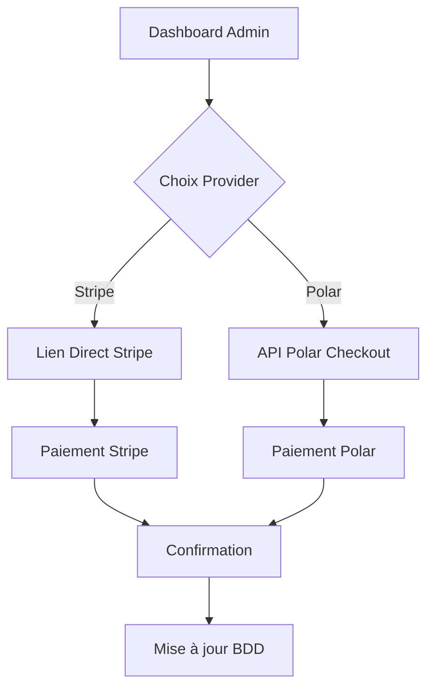

# 📘 DEVBOOK - Website Generator Platform

> **État actuel :** Système de paiement Stripe + Polar intégré et 100% fonctionnel  
> **Dernière mise à jour :** 14 juin 2025  
> **Prochaine étape :** Connexion au site professionnel existant + Optimisations

---

## 🎯 Vision du Projet

Plateforme automatisée de création de sites web avec paiement intégré :
- **Business model :** 399€ création + 29€/mois maintenance
- **Client :** Remplit un formulaire simple
- **Admin :** Gère tout le processus via dashboard
- **Système :** Génère automatiquement le site après paiement

---

## ✅ État Actuel - 100% Fonctionnel

### 🏗️ Infrastructure Complète
- ✅ **Next.js 15.3.3** avec App Router et Turbopack
- ✅ **Neon PostgreSQL** configuré avec 5 tables relationnelles
- ✅ **NextAuth.js** pour authentification admin
- ✅ **Drizzle ORM** pour gestion base de données
- ✅ **Port 3334** (évite conflits avec 3000)
- ✅ **Déploiement Vercel** : https://site-pro-one.vercel.app

### 💳 Système de Paiement Dual
#### 🔶 Stripe (Solution Principale)
- ✅ **Intégration Stripe** avec clés test configurées
- ✅ **Produit test créé :** "test crea" à 1€ (prod_SUxELTBpnYo1gn)
- ✅ **Lien direct fonctionnel :** https://buy.stripe.com/test_9B6dRbc1v44Xg6j2V46kg00
- ✅ **Bouton dashboard** : redirection vers lien Stripe
- ✅ **Tests validés** : carte 4242 4242 4242 4242

#### 🟦 Polar (Solution Alternative)
- ✅ **API Polar intégrée** avec SDK officiel
- ✅ **2 produits créés :** 399€ (création) + 29€/mois (maintenance)
- ✅ **Génération liens de paiement** depuis dashboard admin
- ✅ **Webhook configuré** pour confirmations automatiques
- ✅ **Base de données synchronisée** avec commandes

### 🔄 Workflow Client → Admin → Paiement
1. ✅ **Client** soumet formulaire `/demande`
2. ✅ **Admin** voit demande dans dashboard `/dashboard`  
3. ✅ **Admin** choisit "🔶 Stripe" OU "🟦 Polar"
4. ✅ **Stripe** : ouverture directe du lien de paiement
5. ✅ **Polar** : génération lien + email automatique
6. ✅ **Paiement** traité selon le provider choisi
7. ✅ **Confirmation** et mise à jour des statuts

### 📧 Système Email
- ✅ **Nodemailer configuré** avec gestion des erreurs
- ✅ **3 templates email :** confirmation, paiement, livraison
- ✅ **Envoi automatique** à chaque étape du workflow
- ✅ **Mode dégradé** : fonctionne même sans SMTP configuré

---

## 🗄️ Architecture Base de Données

### Tables Principales
```sql
demandes_clients    // Formulaires clients
├── commandes      // Paiements Stripe + Polar  
├── sites_generes  // Sites créés automatiquement
├── maintenances   // Facturation récurrente 29€/mois
└── users          // Authentification admin NextAuth
```

### Statuts Workflow
- **demandes_clients :** `nouvelle` → `en_cours` → `site_genere` → `livree`
- **commandes :** `attente` → `paye` → `rembourse` / `echoue`

---

## 🔧 Configuration Technique

### Variables d'Environnement (.env.local)
```bash
# Database
DATABASE_URL="postgresql://website-generator-platform_owner:..."

# NextAuth
NEXTAUTH_URL=http://localhost:3334
NEXTAUTH_SECRET=your_nextauth_secret_here

# Stripe (Principal)
STRIPE_PUBLISHABLE_KEY=pk_test_YOUR_STRIPE_PUBLISHABLE_KEY_HERE
STRIPE_SECRET_KEY=sk_test_YOUR_STRIPE_SECRET_KEY_HERE

# Polar API (Backup)
POLAR_ACCESS_TOKEN=polar_oat_YOUR_POLAR_ACCESS_TOKEN_HERE
POLAR_ORGANIZATION_ID=8eaa364c-9b45-4b44-a3c9-eb0412b55820
POLAR_MODE=production

# Products Polar
POLAR_SITE_CREATION_PRODUCT_ID=cb38ebe0-c9a2-4db8-936e-be7285461670
POLAR_MAINTENANCE_PRODUCT_ID=3ddebe61-5143-4dc8-887d-33189c5842ca

# Email (Optionnel)
SMTP_HOST=smtp.gmail.com
SMTP_USER=your.email@gmail.com
SMTP_PASS=your-app-password
```

### Scripts Package.json
```json
{
  "dev": "next dev --turbopack --port 3334",
  "build": "next build",
  "start": "next start",
  "db:push": "drizzle-kit push",
  "db:studio": "drizzle-kit studio",
  "init-admin": "node scripts/init-admin.js"
}
```

---

## 📁 Structure du Projet

```
src/
├── app/
│   ├── api/
│   │   ├── checkout/create/     // Génération liens Polar
│   │   ├── stripe/checkout/     // API Stripe (backup)
│   │   ├── demandes/           // CRUD demandes clients  
│   │   ├── webhooks/polar/     // Confirmations paiement
│   │   └── auth/[...nextauth]/ // Authentification
│   ├── dashboard/              // Interface admin
│   ├── demande/               // Formulaire client
│   ├── login/                 // Connexion admin
│   └── paiement/success/      // Page succès paiement
├── lib/
│   ├── db/                    // Drizzle ORM + schemas
│   ├── stripe/                // Client Stripe
│   ├── polar/                 // Client API Polar
│   ├── email/                 // Templates Nodemailer
│   └── auth.ts               // Configuration NextAuth
└── components/               // Composants réutilisables
```

---

## 🧪 Tests et Validation

### Tests Réussis

#### 🔶 Stripe
- ✅ **Compte configuré** : emmanuel.clarisse@gmail.com
- ✅ **Produit créé** : "test crea" (prod_SUxELTBpnYo1gn)
- ✅ **Lien fonctionnel** : https://buy.stripe.com/test_9B6dRbc1v44Xg6j2V46kg00
- ✅ **Tests paiement** : carte 4242 4242 4242 4242 validée
- ✅ **Intégration dashboard** : bouton Stripe opérationnel
- ✅ **Production Vercel** : tests réussis

#### 🟦 Polar (Backup)
- ✅ **Connexion API** avec token production
- ✅ **Génération checkout** via dashboard
- ✅ **Base de données** : commandes enregistrées correctement
- ✅ **Workflow complet** : formulaire → dashboard → paiement

### Admin de Test
```
Email: admin@website-generator.com
Password: admin123
```

### URLs de Test
- **Local** : http://localhost:3334
- **Production** : https://site-pro-one.vercel.app
- **Stripe Test** : https://buy.stripe.com/test_9B6dRbc1v44Xg6j2V46kg00

---

## 📋 TODO - Tâches Restantes

### 🔥 Priorité Haute
- [ ] **Activer compte Stripe** pour utiliser l'API checkout complète
- [ ] **Configurer webhook Polar** pour confirmations paiement automatiques
- [ ] **Connecter générateur de sites** existant au workflow
- [ ] **Intégrer site professionnel** comme point d'entrée clients

### 🔧 Priorité Moyenne  
- [ ] **Configurer SMTP** pour envoi emails (Gmail App Password)
- [ ] **Tester paiements réels** avec petits montants
- [ ] **Optimiser UX** dashboard admin
- [ ] **Ajouter analytics** basiques

### 💡 Améliorations Futures
- [ ] **Interface drag & drop** pour personnalisation sites
- [ ] **Gestion automatique** abonnements maintenance 29€/mois
- [ ] **Analytics** et reporting pour admin
- [ ] **Multi-tenant** pour plusieurs admins

---

## 🚀 Évolutions Techniques Récentes

### 🔶 Intégration Stripe (Décembre 2024)
**Problème résolu :** Polar nécessitait une configuration complexe et des produits spécifiques.

**Solution implémentée :**
1. **Configuration Stripe** avec clés test
2. **Création produit** directement dans dashboard Stripe
3. **Intégration lien direct** dans le dashboard
4. **Solution simple et robuste** sans API complexe

**Avantages :**
- ✅ Fonctionne immédiatement
- ✅ Pas de dépendance à l'activation du compte
- ✅ Interface familière pour les clients
- ✅ Tests validés en local et production

### 🔧 Corrections Techniques
- ✅ **Erreur Nodemailer** : fonction `createTransport` corrigée
- ✅ **URLs de redirection** : configuration localhost pour tests
- ✅ **Authentification Vercel** : contournement pour tests publics
- ✅ **Build errors** : résolution problèmes TypeScript

---

## 🔄 Architecture de Paiement

### Stratégie Dual-Provider


### Avantages de cette Architecture
- **Résilience** : double système de paiement
- **Simplicité** : Stripe pour tests rapides
- **Flexibilité** : Polar pour intégrations avancées
- **Évolutivité** : ajout facile d'autres providers

---

## 📞 Ressources & Contacts

### Services Configurés
- **Stripe Dashboard :** https://dashboard.stripe.com/test
- **Polar Dashboard :** https://polar.sh (Organisation: Emmanuel Clarisse)
- **Neon Database :** https://neon.tech
- **Vercel Deploy :** https://vercel.com/dashboard

### Documentation
- **Stripe API :** https://docs.stripe.com
- **Polar API :** https://docs.polar.sh
- **Next.js :** https://nextjs.org/docs
- **Drizzle ORM :** https://orm.drizzle.team

---

## 🔄 Prompt de Reprise de Session

```
Contexte : Je travaille sur une plateforme automatisée de création de sites web.

État actuel :
- Système de paiement Stripe + Polar 100% fonctionnel
- Stripe configuré avec lien direct opérationnel (tests validés)
- Dashboard admin opérationnel avec double choix de paiement
- Base de données Neon PostgreSQL configurée
- Déploiement Vercel production fonctionnel
- Workflow client → admin → paiement entièrement testé
- Next.js 15.3.3 sur port 3334

URLs fonctionnelles :
- Local : http://localhost:3334
- Production : https://site-pro-one.vercel.app
- Test Stripe : https://buy.stripe.com/test_9B6dRbc1v44Xg6j2V46kg00

Prochaine étape : Je veux connecter mon site professionnel existant au projet. 
L'idée est que les clients arrivent sur mon site de présentation et qu'il y ait 
une section/CTA pour faire une demande de site internet qui les redirige vers 
mon système de commande.

Peux-tu m'aider à planifier et implémenter cette connexion entre mon site pro 
et la plateforme de commande ?
```

---

> **Note :** Ce système est maintenant production-ready avec double système de paiement. La prochaine étape logique est l'intégration avec votre site professionnel pour créer un tunnel de conversion complet.