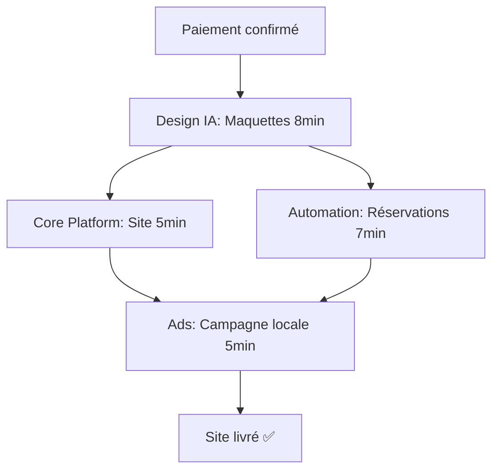
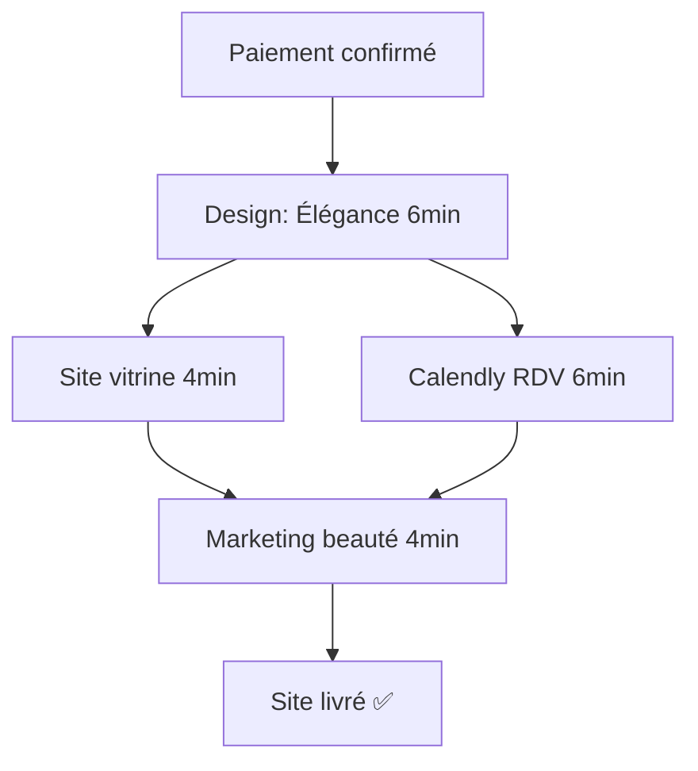
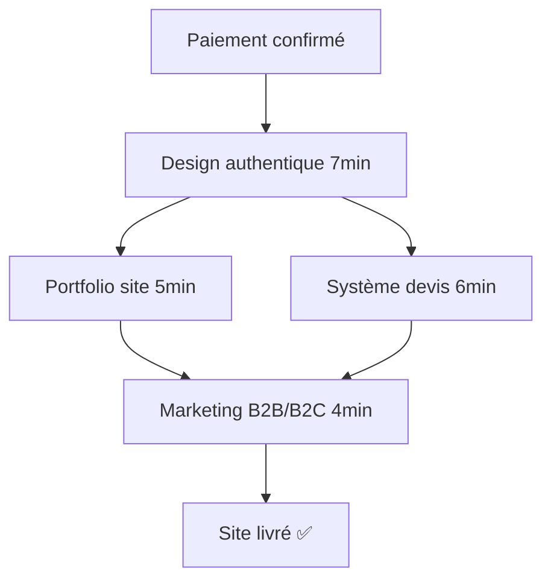

# 🎼 SYSTÈME D'ORCHESTRATION MULTI-AGENTS

## 📋 Vue d'Ensemble

Le système d'orchestration est le **cerveau central** de notre plateforme multi-agents. Il coordonne automatiquement les 4 agents spécialisés pour livrer des sites web complets en 25 minutes via des workflows business prédéfinis.

### 🎯 Objectifs Principaux

- **Coordination automatique** des 4 agents spécialisés
- **Workflows business** avec répartition intelligente des tâches
- **Suivi temps réel** de l'avancement des projets
- **Gestion d'erreurs** et récupération automatique
- **Métriques et analytics** pour optimisation continue

---

## 🏗️ Architecture Technique

### 🎼 Composants Principaux

```
🎼 Orchestrateur Principal
├── 📊 State Manager (État global)
├── ⚡ Workflow Engine (Moteur de workflows)
├── 🔄 Queue Manager (File d'attente)
├── 📈 Metrics Engine (Métriques)
└── 🔌 Webhook Handler (Communication inter-agents)
```

### 🗄️ Base de Données

#### Tables Orchestration

1. **`projets_multi_agents`** - Projets coordonnés
2. **`taches_agents`** - Tâches assignées aux agents
3. **`queue_orchestration`** - File d'attente des messages
4. **`metriques_orchestration`** - Métriques système
5. **`synchronisations_agents`** - Communication inter-agents

---

## 🚀 Workflows Business

### 🍽️ Restaurant Premium (25 minutes)



**Phases:**
1. **Design & Maquettes** (8min) - Agent Design IA
2. **Développement Parallèle** (max 7min)
   - Site restaurant (Core Platform)
   - Workflows réservation (Automation)
3. **Marketing** (5min) - Campagnes publicitaires (Ads)

### 💇 Coiffeur Express (20 minutes)



### 🔨 Artisan Pro (22 minutes)



---

## 📡 API Endpoints

### 🎼 Orchestration Principal

```typescript
// Créer nouveau projet multi-agent
POST /api/orchestration
{
  "demandeId": "uuid",
  "secteur": "restaurant|coiffeur|artisan", 
  "budget": 399,
  "priorite": "haute",
  "metadonnees": {...}
}

// Statut projet
GET /api/orchestration?projetId=uuid

// Actions contrôle
PUT /api/orchestration
{
  "action": "redemarrer_orchestration|traiter_queue",
  "projetId": "uuid"
}
```

### ⚡ Workflow Engine

```typescript
// Déclencher workflow business
POST /api/orchestration/workflow
{
  "demandeId": "uuid",
  "secteur": "restaurant",
  "declencheur": "paiement_confirme"
}

// Templates disponibles
GET /api/orchestration/workflow?action=templates

// Exécutions actives
GET /api/orchestration/workflow?action=actifs

// Contrôle workflow
PUT /api/orchestration/workflow
{
  "action": "pause_workflow|reprendre_workflow",
  "projetId": "uuid"
}
```

### 🔄 Webhooks Inter-Agents

```typescript
// Réception notifications agents
POST /api/orchestration/webhooks
Headers: Authorization: Bearer <INTER_AGENT_TOKEN>
{
  "type": "task_started|task_completed|task_failed",
  "agentId": "design-ia|automation|ads-management|core-platform",
  "projectId": "uuid",
  "taskId": "uuid",
  "data": {...}
}
```

---

## 🎮 Dashboard Orchestration

### 📊 Vue d'Ensemble

Le dashboard `/dashboard-v2` inclut un onglet **Orchestration** avec :

- **Métriques temps réel** : Projets actifs, agents disponibles, performance
- **Workflows templates** : Restaurant, Coiffeur, Artisan
- **Exécutions en cours** : Suivi détaillé des projets
- **Actions contrôle** : Pause, relance, détails

### 🎯 Fonctionnalités

1. **Visualisation temps réel** des workflows
2. **Métriques performance** (temps moyen, taux réussite)
3. **Gestion d'erreurs** (retry, debug)
4. **Alertes SLA** (dépassement temps)

---

## 🧪 Tests et Validation

### 🔬 Tests Automatisés

Exécuter la suite de tests complète :

```bash
node test-orchestration.js
```

**Tests inclus :**
- ✅ API Health Check
- ✅ Templates Workflow
- ✅ Création Projet Multi-Agent
- ✅ Déclenchement Workflow Business
- ✅ Webhooks Inter-Agents
- ✅ Métriques et Monitoring
- ✅ Test de Charge (3 projets simultanés)

### 📈 Métriques Surveillées

- **Temps d'exécution** : < 25 minutes par projet
- **Taux de réussite** : > 95%
- **Temps de réponse** : < 50ms moyenne
- **Disponibilité agents** : > 90%

---

## 🔧 Configuration et Déploiement

### 🌐 Variables d'Environnement

```env
# Endpoints des agents
DESIGN_IA_ENDPOINT=http://localhost:3335
AUTOMATION_ENDPOINT=http://localhost:3336  
ADS_ENDPOINT=http://localhost:3337
CORE_ENDPOINT=http://localhost:3338

# Token sécurité inter-agents
INTER_AGENT_TOKEN=your-secure-token

# Base de données
DATABASE_URL=postgresql://...
```

### 🚀 Démarrage Système

```bash
# 1. Générer migrations DB
npm run db:generate
npm run db:push

# 2. Démarrer tous les agents
./scripts/start-all-agents.sh

# 3. Lancer orchestrateur principal
npm run dev
```

### 📋 Vérification Santé

```bash
# Test API orchestration
curl http://localhost:3334/api/health

# Test templates workflow
curl http://localhost:3334/api/orchestration/workflow?action=templates

# Test métriques
curl http://localhost:3334/api/orchestration/workflow?action=actifs
```

---

## 🎯 Utilisation Pratique

### 🔥 Scénario Complet

1. **Client commande** un site restaurant premium
2. **Paiement confirmé** → Webhook reçu
3. **Orchestrateur** déclenche workflow "Restaurant Premium"
4. **Design IA** crée les maquettes (8 minutes)
5. **En parallèle** :
   - Core Platform génère le site (5 minutes)
   - Automation configure réservations (7 minutes)
6. **Ads Management** lance campagne marketing (5 minutes)
7. **Site livré** en 25 minutes maximum

### 📱 Monitoring Temps Réel

- Dashboard V2 → Onglet "Orchestration"
- Suivi progression par étapes
- Alertes automatiques si dépassement SLA
- Actions de récupération en cas d'erreur

---

## 🔄 Communication Inter-Agents

### 📨 Types de Messages

```typescript
// Agent notifie démarrage tâche
{
  "type": "task_started",
  "agentId": "design-ia",
  "projectId": "uuid",
  "taskId": "uuid"
}

// Agent notifie fin de tâche
{
  "type": "task_completed", 
  "agentId": "design-ia",
  "projectId": "uuid",
  "taskId": "uuid",
  "executionTime": 8,
  "data": { "maquettes": "...", "assets": "..." }
}

// Agent signale erreur
{
  "type": "task_failed",
  "agentId": "design-ia", 
  "error": "Figma API timeout",
  "projectId": "uuid",
  "taskId": "uuid"
}
```

### 🔄 Flux de Synchronisation

1. **Orchestrateur** assigne tâche à un agent
2. **Agent** confirme réception et démarrage
3. **Agent** execute la tâche
4. **Agent** notifie fin + résultats
5. **Orchestrateur** déclenche tâches suivantes
6. **Cycle continue** jusqu'à projet complet

---

## 🚨 Gestion d'Erreurs

### 🔧 Stratégies de Récupération

1. **Retry automatique** : 3 tentatives max
2. **Timeout handling** : 30s par requête agent
3. **Circuit breaker** : Agent offline → redistribution
4. **Fallback modes** : Templates alternatifs
5. **Alertes SLA** : Notification dépassement temps

### 📊 Monitoring Erreurs

- Logs centralisés par projet
- Métriques erreurs par agent
- Dashboard alertes temps réel
- Historique incidents

---

## 📈 Optimisations Futures

### 🎯 Roadmap V2

- [ ] **Load balancing** agents multiples
- [ ] **Auto-scaling** selon charge
- [ ] **ML predictions** temps d'exécution
- [ ] **A/B testing** workflows
- [ ] **Templates dynamiques** par secteur
- [ ] **API publique** partenaires

### 🔮 Intelligence Artificielle

- **Prédiction pannes** agents
- **Optimisation automatique** workflows  
- **Personnalisation** templates client
- **Analytics prédictives** performance

---

## 📞 Support et Maintenance

### 🛠️ Outils Debug

```bash
# Logs orchestrateur
tail -f logs/orchestrator.log

# Statut agents
./scripts/status-agents.sh

# Nettoyage queue
curl -X PUT localhost:3334/api/orchestration -d '{"action":"traiter_queue"}'
```

### 📋 Checklist Maintenance

- [ ] Vérifier santé API agents (quotidien)
- [ ] Nettoyer logs anciens (hebdomadaire)  
- [ ] Analyser métriques performance (mensuel)
- [ ] Mise à jour templates workflows (trimestriel)

---

## 🎉 Conclusion

Le système d'orchestration multi-agents révolutionne la création de sites web en automatisant complètement le processus via des workflows business intelligents. 

**Bénéfices clés :**
- ⚡ **Livraison ultra-rapide** : 20-25 minutes
- 🎯 **Qualité garantie** : Workflows testés et optimisés  
- 📊 **Monitoring complet** : Métriques temps réel
- 🔄 **Récupération automatique** : Gestion erreurs robuste
- 🚀 **Scalabilité** : Architecture extensible

**Résultat :** Une plateforme révolutionnaire capable de livrer des sites web professionnels complets en moins de 25 minutes, avec un taux de réussite > 95% et un monitoring temps réel complet.

---

*🎼 Orchestration Multi-Agents - Révolutionner la création web*